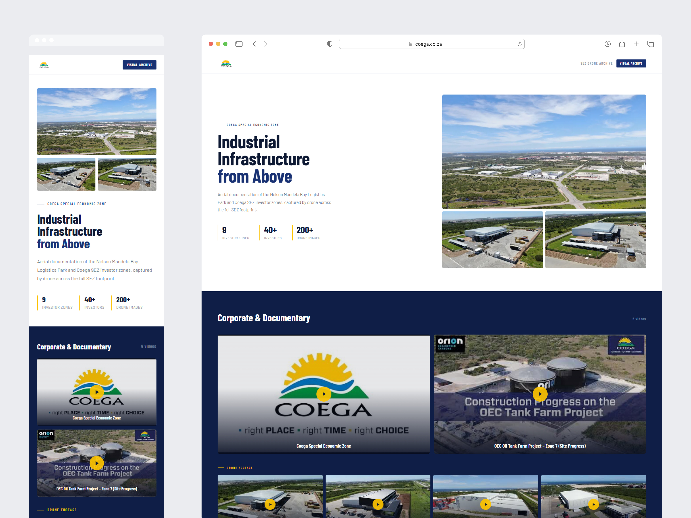
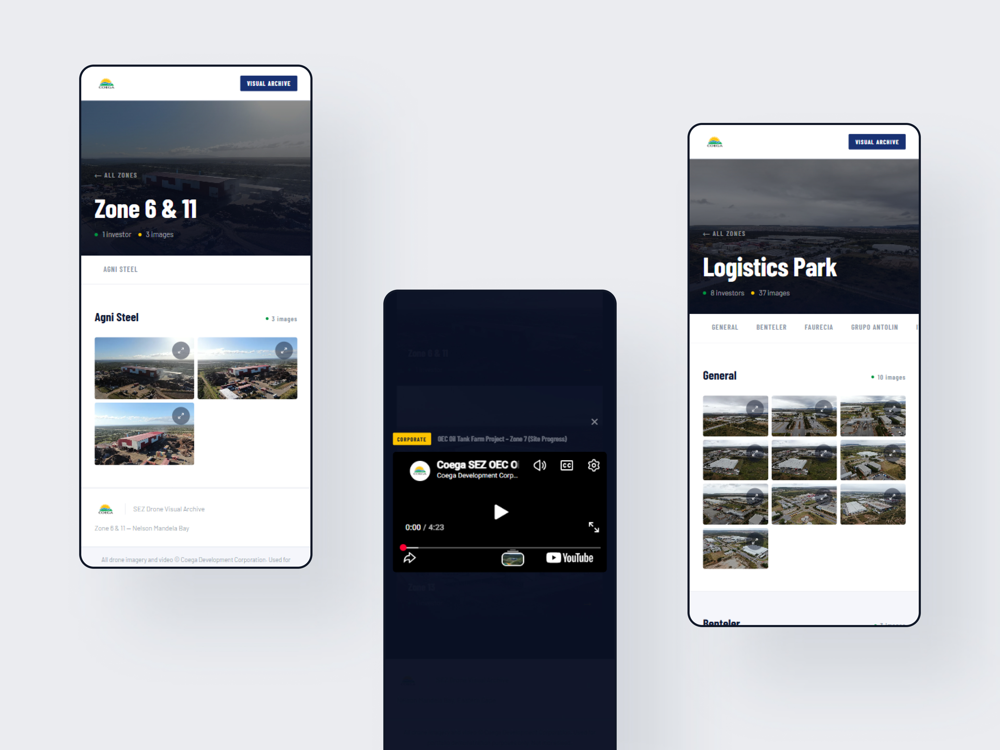
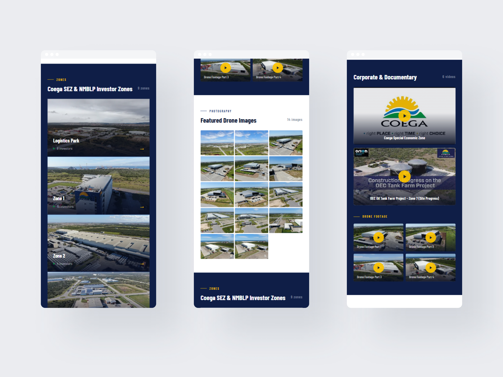
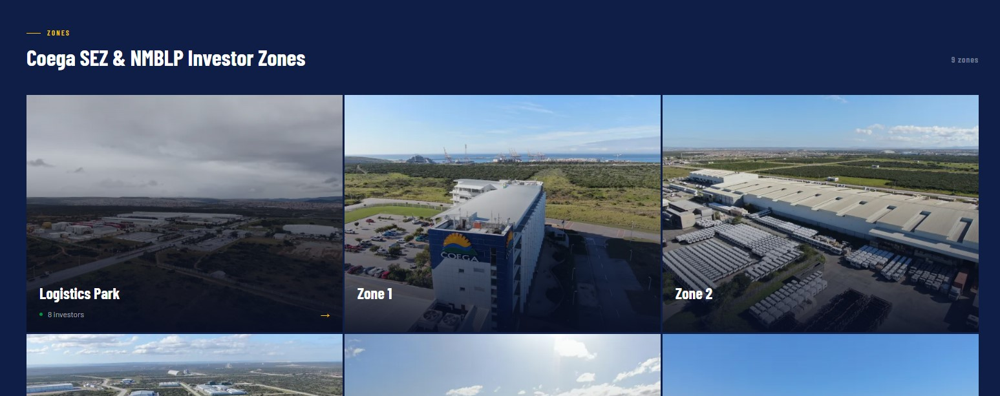

# Coega SEZ — Drone Visual Archive

A visual archive of drone imagery and video footage for the Coega Special Economic Zone (SEZ), Nelson Mandela Bay. Originally built as a plain HTML/CSS internal tool for presenting aerial documentation to potential investors, rebuilt as a production React application with Cloudinary-optimised media delivery, YouTube video embeds, a per-investor lightbox, and a responsive design system grounded in the Coega brand.

---

## Screenshots

### Full Page Overview


### Zone Detail Page and Corporate Video Modal


### Investor Zones Grid





---

## Features

- **Drone footage** — 4 aerial videos served via YouTube unlisted embeds, playing in a modal with autoplay and automatic stop on close
- **Corporate videos** — 2 branded videos (corporate overview and OEC Tank Farm site progress) in the same modal system
- **Featured images** — 14 selected drone images in a responsive strip with a full-screen lightbox
- **9 investor zones** — Logistics Park, Zones 1–5, Zone 6 & 11, Zone 7, Zone 13
- **40+ investors** — each zone page shows investors in dedicated sections with image grids that vary by count
- **Per-investor lightbox** — clicking any image opens a full-screen carousel scoped strictly to that investor's images, never crossing boundaries
- **Responsive** — fully functional from 320px mobile to widescreen desktop
- **Content gate** — single flag in `media.js` takes all media offline in one redeploy
- **Attribution** — copyright notice on every page, noindex meta tag, robots.txt

---

## Tech Stack

| Layer | Technology |
|---|---|
| Framework | React 18 + Vite |
| Routing | React Router v6 |
| Styling | CSS Modules + CSS custom properties |
| Images | Cloudinary (q_auto, f_auto, responsive width transforms) |
| Video | YouTube unlisted embeds via iframe |
| Deployment | Vercel |
| Analytics | Vercel Analytics |

---

## Project Structure

```
src/
  data/
    media.js              Single source of truth — all zones, investors,
                          image paths, video IDs, Cloudinary helpers
  pages/
    Home.jsx              Hero, videos, featured images, zones grid
    ZonePage.jsx          Zone hero, investor tabs, investor sections
  components/
    Nav.jsx               Sticky white nav, logo + pill
    Footer.jsx            Logo + attribution line + location text
    HeroSection.jsx       2-col hero with stats and Cloudinary images
    VideoCard.jsx         Corporate video card with YouTube thumbnail
    DroneCard.jsx         Drone footage card, smaller play button
    VideoModal.jsx        YouTube embed modal, autoplay, iframe cleanup
    FeaturedStrip.jsx     14-image responsive grid with lightbox
    ZoneCard.jsx          Cover image card with hover meta reveal
    ZonesGrid.jsx         3-col responsive grid of zone cards
    ZoneHero.jsx          Full-bleed hero for zone detail page
    InvestorNav.jsx       Sticky scrollable tab bar, scroll-driven active
    InvestorSection.jsx   Per-investor image grid, alternating backgrounds
    ImageItem.jsx         Single image with zoom icon and lightbox trigger
    Lightbox.jsx          Full-screen image viewer, keyboard + touch nav
    Attribution.jsx       Copyright notice bar above footer
    HoldingPage.jsx       Shown when CONTENT_CONFIG.isPublic is false
  styles/
    globals.css           CSS variables, reset, font import, utilities
```

---

## Design System

Brand colors:

| Token | Value | Usage |
|---|---|---|
| Navy | `#183172` | Primary — nav, eyebrows on light, h1 accent, stat borders |
| Navy Deep | `#0e1e47` | Dark section backgrounds |
| Gold | `#FDC300` | Accent — play buttons, eyebrows on dark, zone arrows |
| Green | `#009640` | Status dots only — investor and image counts |

Typography: **Barlow Condensed** (headings, labels) + **Barlow** (body copy)

Section rhythm: white → dark → white → dark → white. Never two consecutive surfaces of the same type.

---

## Media Architecture

All images are hosted on Cloudinary under `coega/images/` with URL-based transforms:

```
Thumbnail grid:  .../w_600,q_auto,f_auto/coega/images/[Zone]/[Investor]/[file].jpg
Featured strip:  .../w_220,q_auto,f_auto/coega/images/[file].jpg
Zone hero:       .../w_1400,q_auto,f_auto/coega/images/[Zone]/[file].jpg
Lightbox full:   .../q_auto,f_auto/coega/images/[Zone]/[Investor]/[file].jpg
```

Thumbnails load fast in grids. Full-resolution only loads when the lightbox opens.

All video is hosted on YouTube as unlisted videos and embedded via iframe.

---

## Content Gate

All media can be taken offline in under 60 seconds:

1. Open `src/data/media.js`
2. Change `isPublic: true` to `isPublic: false`
3. `git add . && git commit -m "chore: disable content" && git push`
4. Vercel redeploys automatically

When `isPublic` is `false`, every route renders `HoldingPage` and no media loads.

---

## Getting Started

```bash
# Install dependencies
npm install

# Run development server
npm run dev

# Production build
npm run build
```

---

## Copyright Notice

All drone imagery and video © Coega Development Corporation.  
Used for portfolio demonstration purposes only. Not monetised.  
This project is not affiliated with or endorsed by Coega Development Corporation.